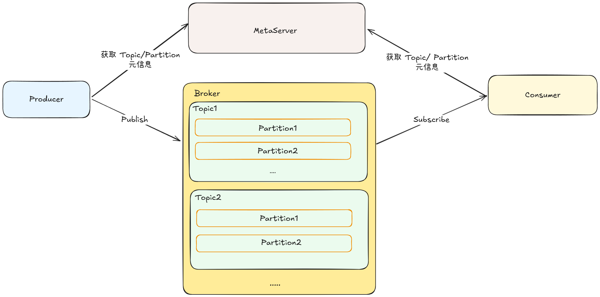
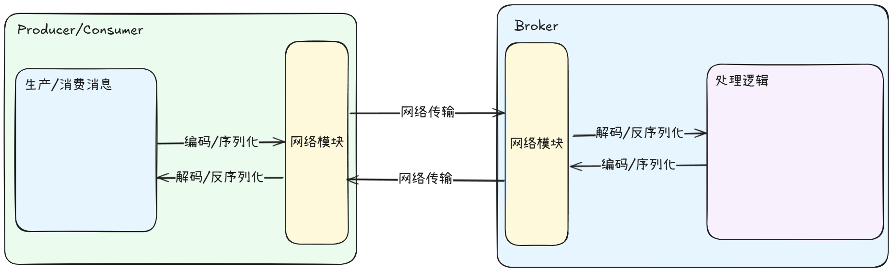
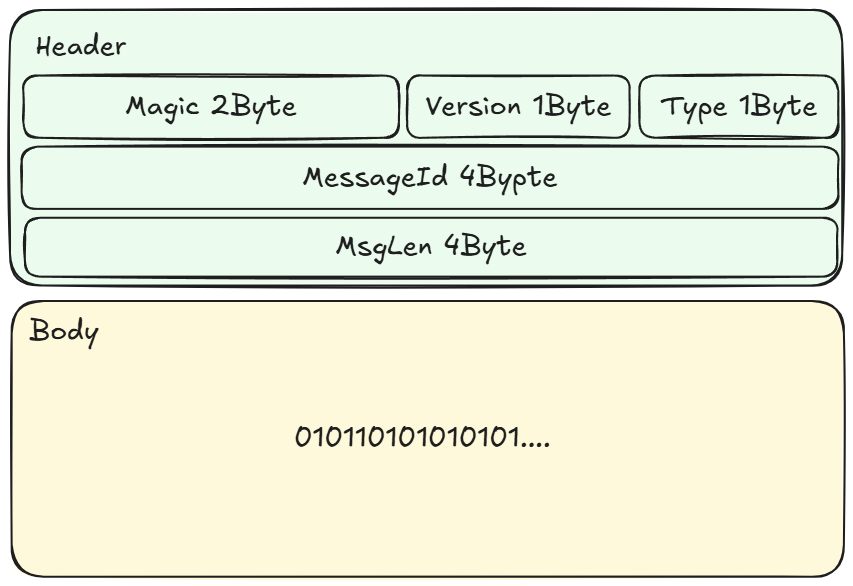
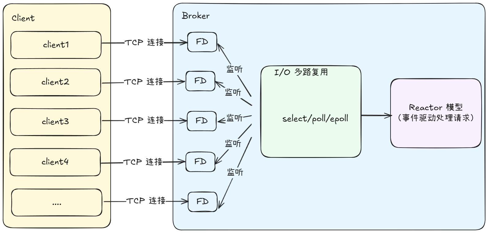
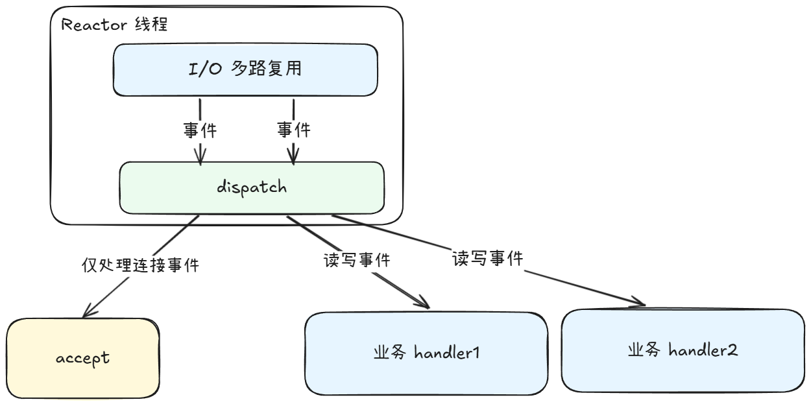

# 如何手写一个消息队列
## 1. 整体框架

消息队列的整体架构如图所示，包含生产者、消费者、存储元数据的 MetaServer、实际存储 Topic/Partition 的 Broker

## 2. 核心模块划分
### 2.1 网络模块

Producer 生产一个消息之后，根据通讯协议进行编码，然后进行序列化，最后发送到网络中，经过网络传输之后到达 Broker， Broker 经过反序列化之后，根据通讯协议进行解码，Broker 讲过内部处理之后，Consumer 按照同样的流程从 Broker 获取消息进行消费。

从这个流程上来看，我们看到性能瓶颈在几个地方：
1. 编解码、序列化/反序列化的速度
   * 可以选择更加编解码更快，序列化/反序列化更快的算法进行优化
2. 网络传输速度
   * 这一个我们没办法在应用层面去进行优化 
3. 网络连接管理
   * 随着客户端和服务端的网络连接数量增多，网络连接增多，我们应该如何进行高效管理连接、处理连接事件
4. 并发请求处理
   * 面对海量的请求，应该如何高效处理这些请求

#### 2.1.1 消息协议
消息协议的设计应该要有以下几个特点：1. 消息大小尽可能小，消息队列的吞吐和消息的大小成反比  2. 可扩展，消息协议需要能做到向前兼容，方便功能扩展。

一个完整的消息会包含 header 和 body 两部分，其中
* header： 消息头
  * Magic：魔数，用来快速标识是否为需要处理的“合法”数据
  * Version：版本，方便后续兼容升级
  * Type: 消息类型，标识消息为生产者请求、消费者请求、ACK 等消息类型
  * MessageId： 消息唯一标识，实现全双工通信
  * MsgLen： 消息长度，为 Body 的消息长度
* body: 消息体
  * 承载按照特定序列化之后的产物，即实际的数据

所以，消息头固定长度为 `12 Byte` ，消息体的长度由 `MsgLen` 决定
#### 2.1.3 序列化方式
todo
#### 2.1.4 连接管理
面对海量的 TCP 连接，目前主流的处理方式都是借助 I/O 多路复用实现。

对于 TCP 连接，Broker 会为将分配一个 `FD(文件句柄)`, 然后将其注册到 `select/poll/epoll` 上，后续 `select/poll/epoll` 会监听 `FD` 的各种事件（读/写/就绪等事件），然后配合 **Reactor 事件驱动模型高效处理请求。**
#### 2.1.5 事件驱动模型
Reactor 模型，是一个异步事件驱动模型；

Reactor 负责接受所有事件，然后根据事件类型去做分发，所有的连接事件都由 accept 处理，读写事件则分发给到业务 handler 去处理。

### 2.2 生产者

### 2.3 消费者
### 2.4 数据存储